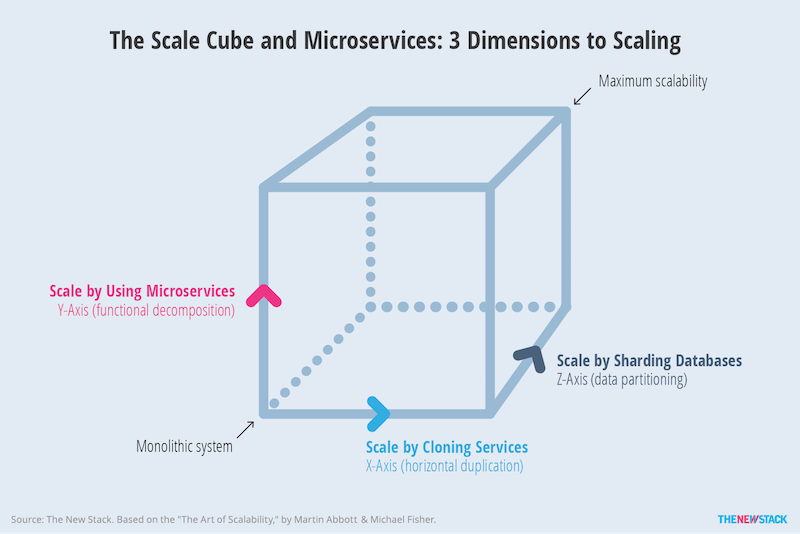
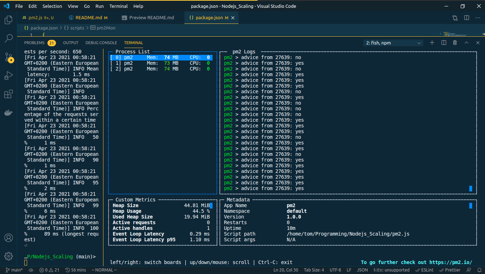

<!-- @format -->

# Nodejs_Scaling

- Scaling can done by
  - cloneing/forking
  - partioning [ Sharding ]
  - microservices

## Auto tools for clustering and loadbalancing

`............................................ PM2 .................................`

- `Advanced process manager for production Node.js applications.`
- `Load balancer, logs facility, startup script,`
- `micro service management, at a glance.`

## `My PM2 tool on my Machine`

